# NineOne · Geo

Standalone GIS prototype for RF engineers on Japan’s RAN. This folder is **not** the NineOne console app. The product lives in `ns-qaw-a/`. The briefing that defines it is `mapsheetzero.html`.

**Instrument, not catalogue.** The map should explain a site — azimuth, alarms, measurements, time — not be a checkbox list of twenty-one layers.

## What’s in this repo

| Path | Role |
|------|------|
| `mapsheetzero.html` | Ideation brief. Libraries are *ideas to steal*, not engines to adopt. |
| `STACK.md` | Locked stack for later product work (MapLibre, not Cesium globe). |
| `ns-qaw-a/` | Runnable prototype: MapLibre + deck.gl, TOK cluster ingest. |
| `data/` | Raw RMI / demo dumps. **Gitignored.** Needed only to re-run ingest. |

Open `mapsheetzero.html` in a browser to read the brief (tokens, provocations P1–P10, reference shelf, four foundations).

**How the pieces connect**

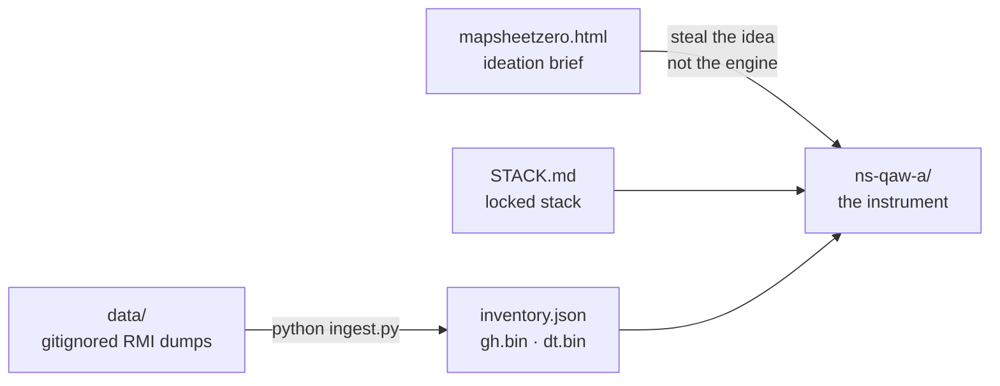

## What we built

A full-bleed Tokyo RAN map that opens on **2D plan view**. 3D is a switch, not the default (P9).

### Data (last ingest)

- **25 sites / 75 cells** — TOK cluster B3 4G macro from the cell plan.
- Status: 16 on-air, 3 planned, 2 partial, 4 locked (decommissioned: TOK_003, 004, 009, 017).
- **2 in alarm** (TOK_NEW_02 VSWR/critical, TOK_NEW_05).
- **8,503 Groundhog** + **5,235 drive-test** Tokyo-bbox points in packed binaries (`gh.bin`, `dt.bin`), not GeoJSON.
- Clock snapshot `2026-07-18T11:40:00+09:00` ← tok-fm.
- ECGI `440-11-{enbId}-{cellId}`. Honest empty facets: mmWave, 5G Sub-6, RIUD, DAS are **0** with a reason — nothing invented.
- Sukayat alarms: chat index only (no coordinates → no pins).

**Ingest — raw dumps become a published inventory**

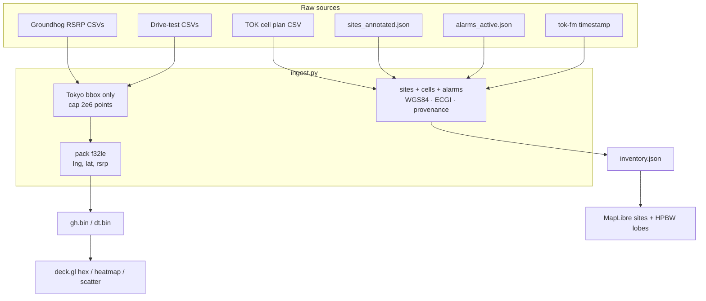

### Mapsheet Zero — what we took (not the product)

| Source | Took this | In the prototype |
|--------|-----------|------------------|
| **CesiumJS** | Clock widget (play / pause / speed / range). **Not the globe.** | Shared clock bar. Disabled play until more than one timestamp exists. |
| **deck.gl** | GPU hex bins, heatmaps, instant hover. Million-point path. | `gh.bin` / `dt.bin` as typed arrays. HexagonLayer (zoom below 11), HeatmapLayer, ScatterplotLayer. |
| **Mapbox GL JS** | Feature-state hover/select on the GPU. | MapLibre `feature-state` on sites and sectors. |
| **Esri VFRS** | 2D · 3D switch so 3D earns its place. | Segment control. Terrain + buildings + beams only in 3D. |
| **QGIS** | Verbs, layer tree. | Filters drawer: toggles with sample counts, facets, table on the site card. |
| **Dynamic beams** | Real HPBW `gain()` lobes, not pie slices. | Gaussian −3 dB + back lobe in `lobes.js` (same math as the mapsheetzero hero canvas). |
| **xMap.ai** | Frozen recipe / snapshot. | URL hash `#r=…` (layers + filters + camera + selection). Snapshot copies that link. |
| Terrain / buildings | Japan elevation + city model. | AWS Terrarium DEM + OpenFreeMap building extrusions as stand-in for GSI / PLATEAU. |

### Four foundations

1. **Clock** — one control for every layer. Current ingest is a single frozen moment.
2. **Selection** — pick a site on the map or from search; the card, highlight, and recipe update together.
3. **Recipe** — layers + filters + view + camera as one object. Copilot authors it. Links carry it.
4. **Provenance** — shapes say where they came from (`← cell-plan`, `← tok-fm`, `← gh.bin` / `dt.bin`).

**Clock, selection, recipe, provenance**

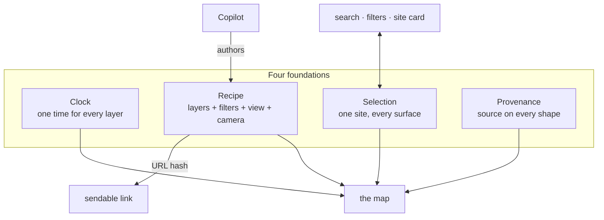

### Map behaviour

- **LOD (P3 / STACK):** dots below zoom 10 · HPBW wedges zoom 10–15 · 3D beams only above zoom 15 and only in 3D.
- **Co-site:** radial metre-offset so three sectors on one rooftop are honest; spider lines at z ≥ 14.
- **Colour is scarce (P4):** Groundhog heatmap intensity drops when sector lobes are on.
- **Copilot (P7):** floating chat widget with deterministic parser first, then LLM fallback with per-user memory and streaming responses.
- **Search:** SARF, ECGI, cell, eNB. `/` focuses find.
- **Measure:** ruler and radius via Turf (not Terra Draw yet).
- **Export:** GeoJSON, KML, PNG snapshot + recipe URL on the clipboard.

**Sector LOD**

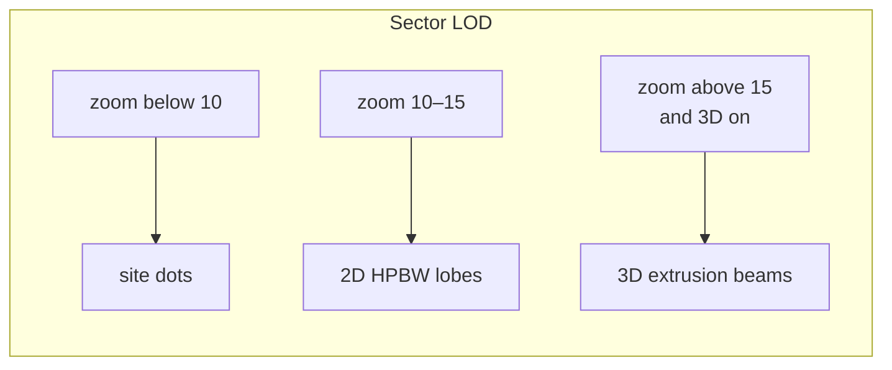

**3D has to earn its place**

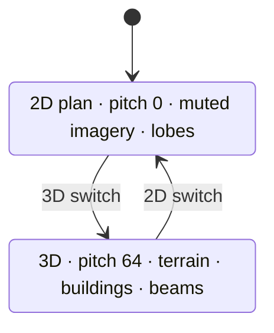

### Stack actually running in `ns-qaw-a`

| Piece | Choice |
|-------|--------|
| Map core | **MapLibre GL JS 5.6.2** (CDN) |
| GPU measurements | **deck.gl 9.1.12** `MapboxOverlay` |
| Geometry helpers | **Turf 7** |
| 2D basemap | Inline muted Esri imagery (`planStyle`) — reliable load |
| 3D | Terrain + hillshade + OpenFreeMap buildings |
| Datum | WGS84 / EPSG:4326 |

**Not used:** Cesium engine, Leaflet, kepler.gl, ArcGIS runtime. Fake rooftops are forbidden.

**What runs in the browser**

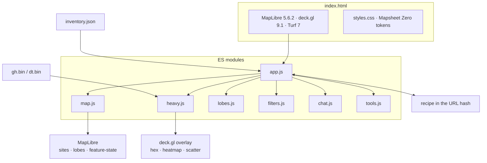

## Copilot architecture (current)

Copilot now runs as a deterministic-first assistant:
- First try `parseAsk(...)` for known RF/map commands.
- If unmatched, stream fallback response from `/api/chat/stream`.
- Maintain per-user memory and follow-up reference context.

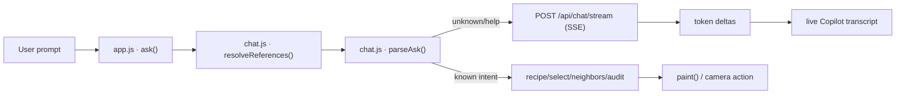

### Per-user memory and follow-up context

- Browser generates a stable `user_id` and sends it on every request.
- Server keeps a memory bucket per `user_id`.
- Memory stores natural user prompts + assistant answers.
- Reference context stores `lastSiteId` and `lastSiteList` for follow-ups like:
  - `that site`
  - `second one`
  - `one with VSWR alarm`
  - `one in Shibuya`

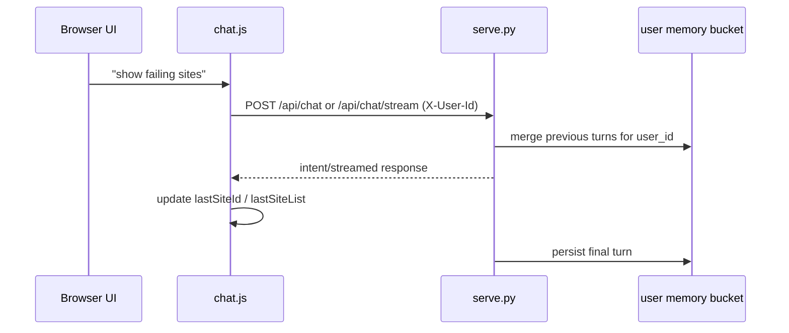

### Copilot API surface

| Route | Method | Purpose |
|------|--------|---------|
| `/api/chat` | POST | Non-stream JSON completion path |
| `/api/chat/stream` | POST | SSE stream for unknown prompts |
| `/api/chat/memory` | GET | Inspect memory for a `user_id` |
| `/api/chat/reset` | POST | Clear memory for a `user_id` |

## Runtime behavior and safeguards

### Camera behavior (anti-blank-map rules)

- Camera flies only to valid in-region coordinates.
- If selected/matched site has invalid or missing coordinates, camera is not moved.
- `flySet(...)` filters invalid points before `fitBounds(...)`.
- Result: no accidental zoom-out-to-nowhere from bad geometry.

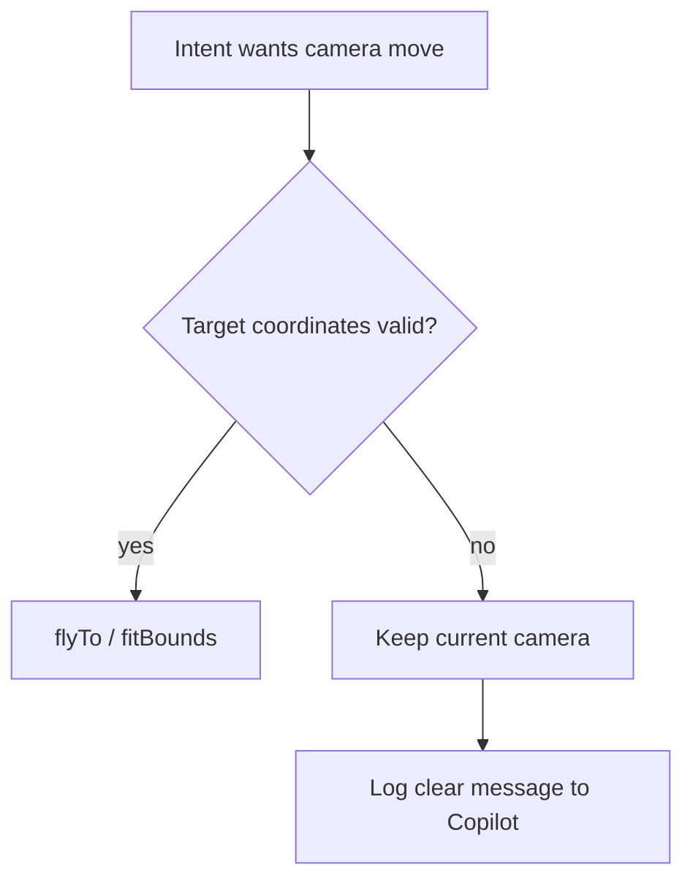

### Basemap switch resilience

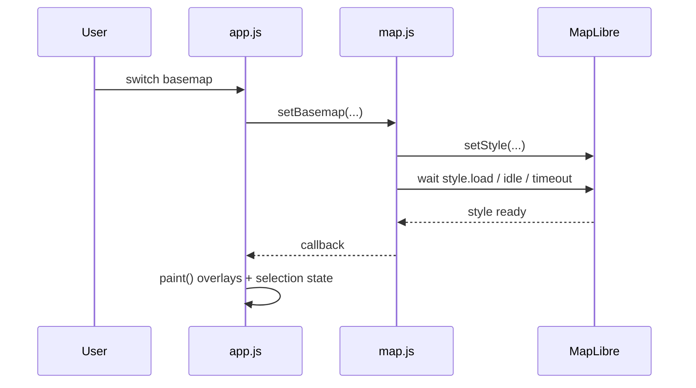

### Snapshot pipeline (PNG fix)

The snapshot path was hardened to avoid black/blank exports:
- wait for map readiness
- composite visible canvases (MapLibre + deck.gl) into one output canvas
- validate non-blank image before final download

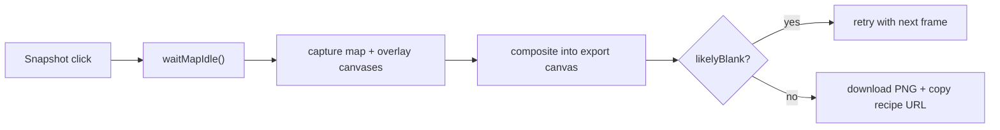

## Interaction flows

### Copilot command routing

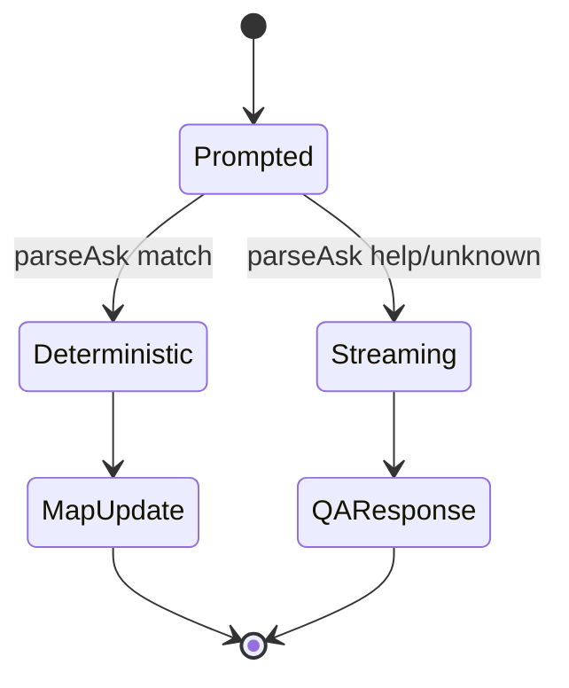

### B1 neighbor workflow

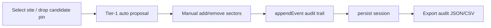

## How to run

No npm install. The app is static files plus a JSON inventory.

### 1. Serve the instrument

From this repo:

```bash
cd ns-qaw-a
python serve.py
```

Open [http://127.0.0.1:8765/](http://127.0.0.1:8765/).

`serve.py` serves the static files and Copilot backend routes:
- `POST /api/chat` — JSON completion fallback path.
- `POST /api/chat/stream` — SSE streaming path for unknown prompts.
- `GET /api/chat/memory` — inspect per-user memory.
- `POST /api/chat/reset` — clear per-user memory.

Plain `python -m http.server 8765` still works for map-only browsing, but Copilot backend routes require `serve.py`.

Do **not** open `index.html` as a `file://` URL — ES modules and `fetch('./inventory.json')` need a local server.

Needs: Python 3, a browser with WebGL. First load pulls MapLibre / deck.gl / Turf from CDNs (needs network).

`inventory.json`, `gh.bin`, and `dt.bin` are already in `ns-qaw-a/` so the map runs **without** the raw `data/` folder.

**Boot**

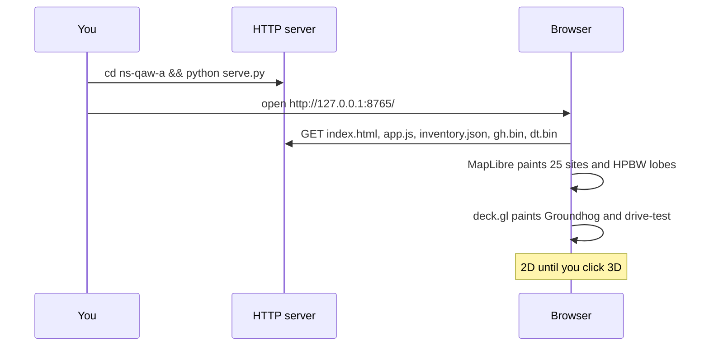

### 2. Re-ingest (optional)

Only if you have the RMI dump at `data/RMI Datasets-…` and want to rebuild inventory:

```bash
cd ns-qaw-a
python ingest.py
```

Writes `inventory.json`, `ingest-report.json`, `gh.bin`, `dt.bin`. Then refresh the browser.

Cap on packed points is 2e6. Tokyo bbox only. TKY-* sample rows from the parent `data-layer` are ignored, not plotted.

### Keyboard

| Key | Action |
|-----|--------|
| `/` | Focus search |
| `f` | Filters |
| `c` | Copilot |
| `Esc` | Clear selection and close drawers |

## Layout of the instrument

```
ns-qaw-a/
  index.html          shell, CDNs, 2D/3D, clock, copilot
  styles.css          Mapsheet Zero-inspired light theme tokens + Copilot widget styling
  app.js              boot, recipe hash, search, copilot wiring
  map.js              MapLibre style, LOD layers, feature-state, 2D/3D
  heavy.js            deck.gl overlay + packed .bin reader
  lobes.js            gain() HPBW polygons, co-site offset
  filters.js          recipe, facets, empty-count reasons
  chat.js             NL parser + reference resolver + memory/stream chat client
  tools.js            search, measure, import, GeoJSON/KML/PNG (robust snapshot composition)
  ingest.py           cell plan + annotated + tok-fm + GH/DT
  inventory.json      published sites/cells + clock + provenance
  gh.bin / dt.bin     f32le triplets: lng, lat, rsrp
  ingest-report.json  last ingest counts
```

## What we did not build yet

These are in the brief or `STACK.md` and are **not** in this prototype:

- Playable Cesium-style clock (range / speed) — needs more than one timestamp in the ingest.
- Before/after (P2), viewshed, Split view.
- Official GSI elevation and PLATEAU 3D city tiles.
- Terra Draw (ruler/radius is Turf only).
- PMTiles / country-scale vector tiles.
- QGIS-style reorderable opacity tree and map↔attribute table for the full inventory.

## Known limitations (current build)

- Copilot backend memory is process-local (in-memory in `serve.py`), so restarting server clears backend memory.
- Reference resolver supports common follow-up forms, but ambiguous natural language may still fall back to generic QA.
- SSE streaming is primary for unknown prompts; provider fallback can return as one chunk depending on upstream response mode.
- Area phrase matching (`one in <area>`) depends on text presence in site metadata fields from ingest.
- Alarm phrase matching (`one with <alarm>`) depends on normalized alarm `problem` text in inventory.
- GPU measurement exports remain visual-only in PNG; GeoJSON/KML exports include vector layers and DT routes, not full GH/DT point clouds.

## QA checklist (release sanity)

Run this after `python serve.py` and open `http://127.0.0.1:8765/`.

### A) Core map + camera

- [ ] Basemap switch (`Plan` ↔ `Satellite` ↔ `Terrain`) keeps overlays and selection without refresh.
- [ ] Selecting a site highlights it and opens contextual card data.
- [ ] Invalid target geometry does not zoom out to blank world; view remains stable with an explanatory Copilot message.
- [ ] `daily drive test` shows DT routes + points and focuses near valid context.

### B) Copilot interaction

- [ ] Typed prompt appears immediately in transcript (no one-step lag).
- [ ] Unknown prompt streams progressively (token-like) instead of appearing only at end.
- [ ] Follow-up references resolve correctly:
  - [ ] `that site`
  - [ ] `second one`
  - [ ] `last 3 sites`
  - [ ] `one with VSWR alarm`
  - [ ] `one in Shibuya` (or other area text available in ingest)
- [ ] `show memory` returns count; `reset memory` clears server-side session for current user.
- [ ] `Clear` clears local visible transcript; `Reset` clears backend memory context.

### C) Export + evidence

- [ ] Snapshot PNG is non-blank and includes active map state.
- [ ] Snapshot action copies recipe URL to clipboard.
- [ ] GeoJSON/KML export succeeds and includes enabled vector layers (including DT routes when enabled).
- [ ] Neighbor session audit exports JSON/CSV after add/remove edits.

### D) Keyboard + UX

- [ ] `/` focuses search, `f` toggles Layers, `c` toggles Copilot, `Esc` clears/close state.
- [ ] Copilot layout remains usable at desktop and mobile widths (header controls, prompt chips, composer).
- [ ] Copilot status indicator transitions: `Ready` → `Thinking...` → `Responding...` → `Ready`.

## Constraints we kept

- Read-only. The map never writes the live network.
- No fake precision: no invented mmWave / RIUD / DAS rooftops, no guessed pins.
- TOK_001 azimuths come from the CSV (234 / 324 / 108), not a generic 0/120/240 pie.
- Speed: GPU layers for measurements; GeoJSON only for ~25 sites and their lobes.
