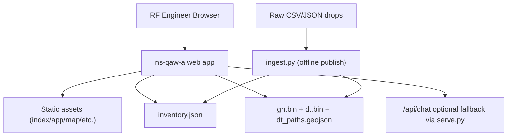
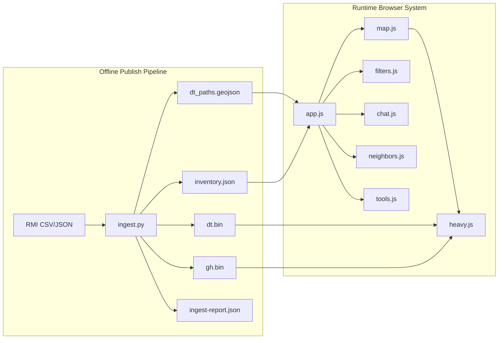
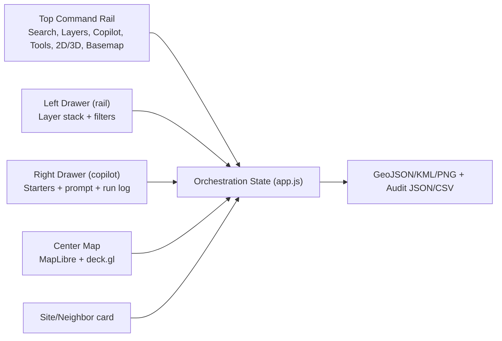
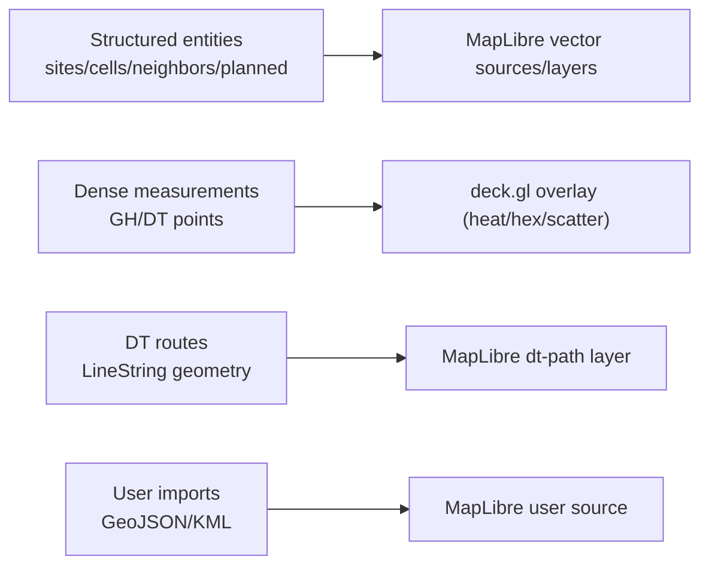
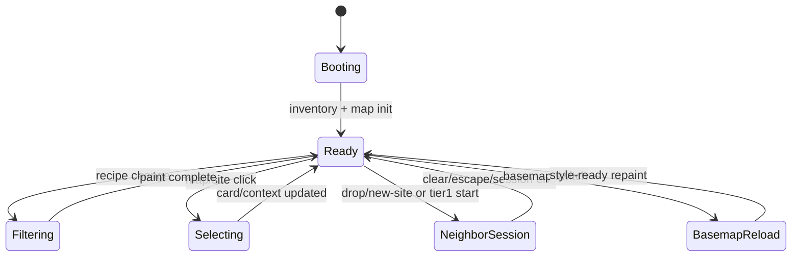
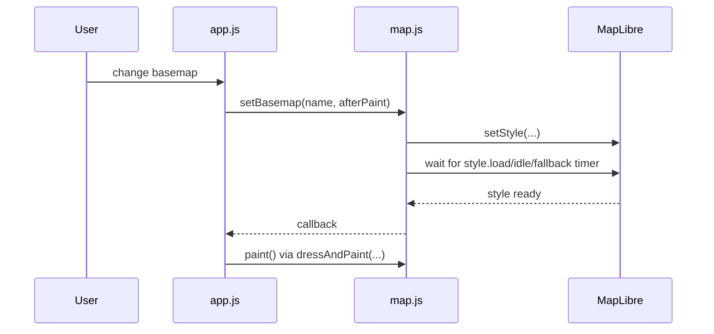
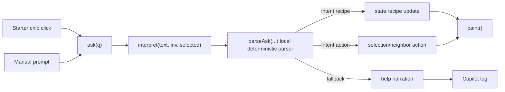
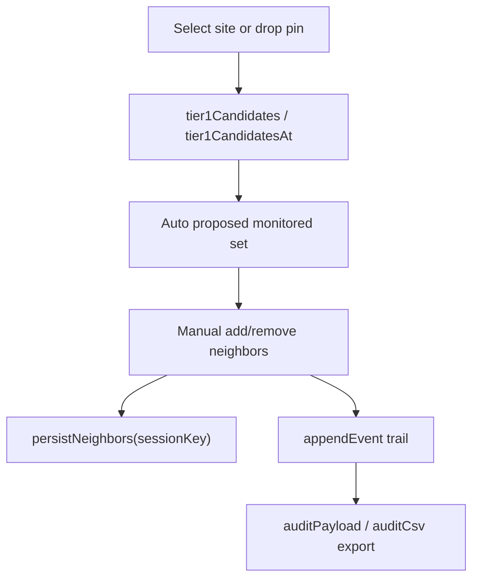
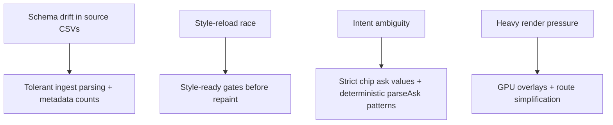

# NS-QAW V1 High-Level Design (HLD)

## 1) Purpose
This document defines the V1 architecture for the Tokyo RF GIS workbench in `ns-qaw-a`.

V1 delivery scope:
- A1: Site and layer visualization
- A2: Sector/azimuth rendering
- A3: Basic map operations and exports
- B1: New-site + Tier-1 neighbor workflow via map + Copilot

## 2) Product Principles
- **Instrument-first UX:** map is the decision mechanism, not a passive layer catalog.
- **Deterministic controls:** every UI command maps to a concrete recipe/session mutation.
- **Low-latency rendering:** vector for structured entities, GPU overlays for dense points.
- **Traceable actions:** site/neighbor decisions must be exportable and replayable.

## 3) Scope and Boundaries
### In Scope
- Filters, layer toggles, site and sector rendering.
- Basemap switching and 2D/3D mode switch.
- Search, ruler/radius, import/export/snapshot.
- Copilot starter chips + parser-driven commands.
- Neighbor session lifecycle (auto-propose, manual adjust, audit export).

### Out of Scope
- B2+ KPI timeline analytics and alarm blast-radius scoring.
- UE trace playback and full KG traversal workflows.
- Automated RCA recommendation beyond current intent verbs.

## 4) Deployment Context

## 5) Architecture Overview

## 6) Functional Surfaces

## 7) Data Partitioning Strategy

Reasoning:
- keeps interaction fast at V1 densities.
- avoids giant GeoJSON for measurement clouds.
- permits route path rendering while retaining DT point samples.

## 8) State Model (High-Level)

## 9) Basemap Resilience Design

This design matches the current anti-regression fix for disappearing overlays on style switch.

## 10) Copilot Architecture (V1)

## 11) B1 Workflow Architecture

## 12) Key NFRs
- **Performance:** map interaction remains fluid with GH/DT overlays enabled.
- **Consistency:** terminology and commands stay aligned (`Copilot`, `Layers`, `New site`).
- **Reliability:** basemap change does not require full refresh.
- **Auditability:** neighbor decisions are reproducible from exported trail.

## 13) Risks and Controls

## 14) V1 Acceptance Criteria
- A1/A2/A3/B1 workflows operate without page reload.
- `dtLayer` shows DT points and DT routes together.
- basemap switch preserves visible layers and selection context.
- Copilot starters route to intended section/action consistently.
- Tier-1 audit export yields deterministic JSON/CSV traces.
