# NS-QAW V1 Low-Level Design (LLD)

## 1) Purpose
This document specifies module-level behavior, runtime contracts, and render/control flows for V1 (`A1-A3 + B1`) in `product/`.

## 2) File-Level Architecture
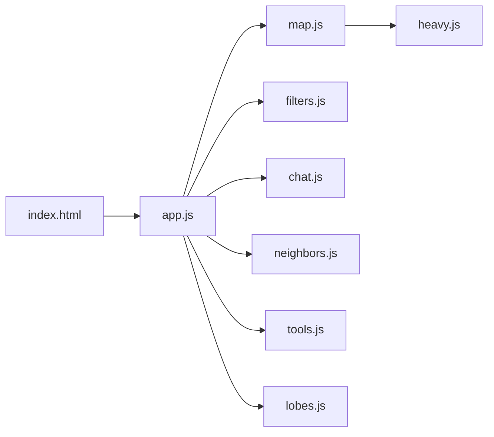

## 3) Module Responsibilities

## 3.1 `index.html`
- Provides shell primitives:
  - top rail, tools, view switch, basemap selector
  - left drawer (`rail`), right drawer (`copilot`)
  - center map stage, context strip, telemetry footer
- mounts module entrypoint `app.js?v=*`.

## 3.2 `app.js`
- Owns global state:
  - `inv`, `recipe`, `selected`, `section`, `neighbors`
  - `tool`, `measurePts`, `userFc`, `geo`, `map`
  - `heavy.gh`, `heavy.dt`, `dtPaths`, `holesFc`
- Key methods:
  - `boot()`: load inventory/heavy assets; map create + bind.
  - `paint()`: compute filtered model and re-render map/UI.
  - `ask()`: Copilot command entrypoint.
  - `startNeighbors()/startNeighborsPin()`: B1 session open.

## 3.3 `map.js`
- map setup and source/layer creation.
- style-safe basemap switching (`setBasemap(...)`).
- vector painting via `dressAndPaint(...)`.
- export visibility projection via `visibleLayers(...)`.

## 3.4 `heavy.js`
- parses packed float arrays from `gh.bin` / `dt.bin`.
- renders deck.gl overlays:
  - GH: hex/heat/scatter/contour
  - DT: scatter points
- manual pick bridge to probe details.

## 3.5 `filters.js`
- `defaultRecipe()`, `applyRecipe(...)`, facet rendering.
- chip generation and chip dismissal.

## 3.6 `chat.js`
- `contextChips(...)`: deterministic quick actions by section.
- `parseAsk(...)`: maps command text to `recipe|action|help`.
- `resolveReferences(...)`: rewrites follow-ups (`that site`, ordinal picks, area/alarm references) to explicit site IDs where possible.
- `interpretWithStream(...)`: local parser first, then `/api/chat/stream` fallback with progressive deltas.
- per-user identity + local reference context persistence.

## 3.7 `neighbors.js`
- Tier-1 candidate generation and distance/geometry checks.
- monitored set state, event trail, and audit exports.

## 3.8 `ingest.py`
- source normalization and publish artifacts:
  - `inventory.json`
  - `gh.bin`, `dt.bin`
  - `dt_paths.geojson`
  - `ingest-report.json`

## 3.9 `serve.py`
- static file host + chat API surface:
  - `POST /api/chat`
  - `POST /api/chat/stream` (SSE)
  - `GET /api/chat/memory`
  - `POST /api/chat/reset`
- OpenAI primary + Claude fallback.
- per-user memory merge and turn persistence.

## 4) Runtime State Model
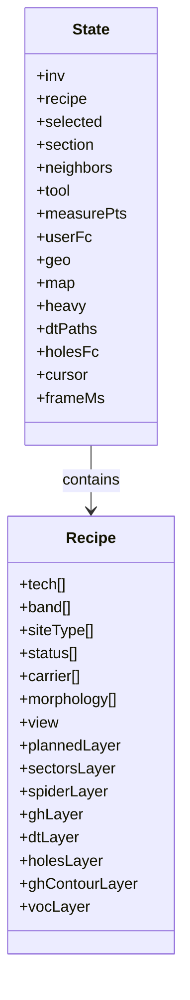

## 5) Boot and Initialization Flow
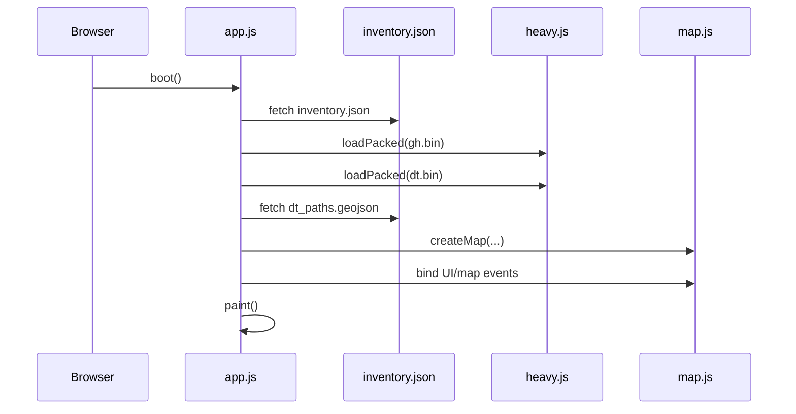

## 6) Paint Pipeline
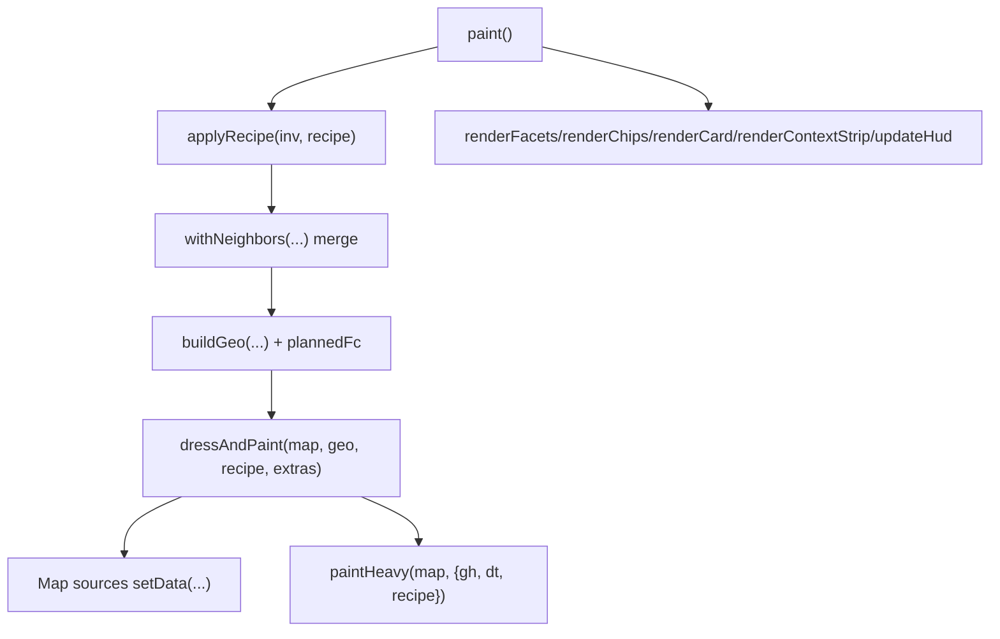

## 7) Basemap Switch Control Flow
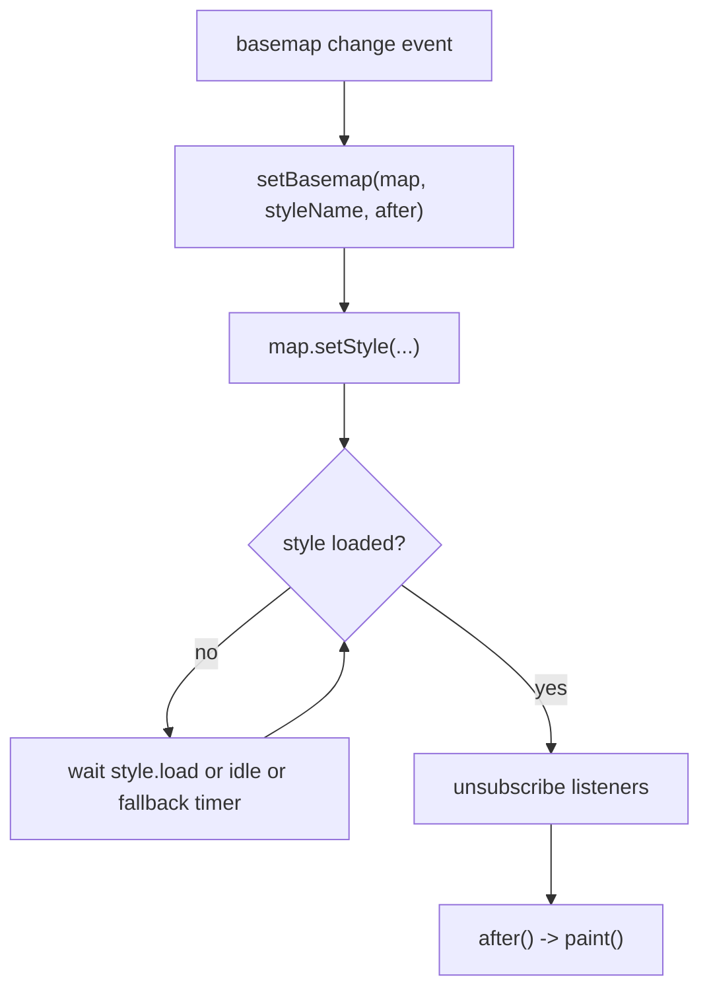

## 8) Copilot Intent Resolution
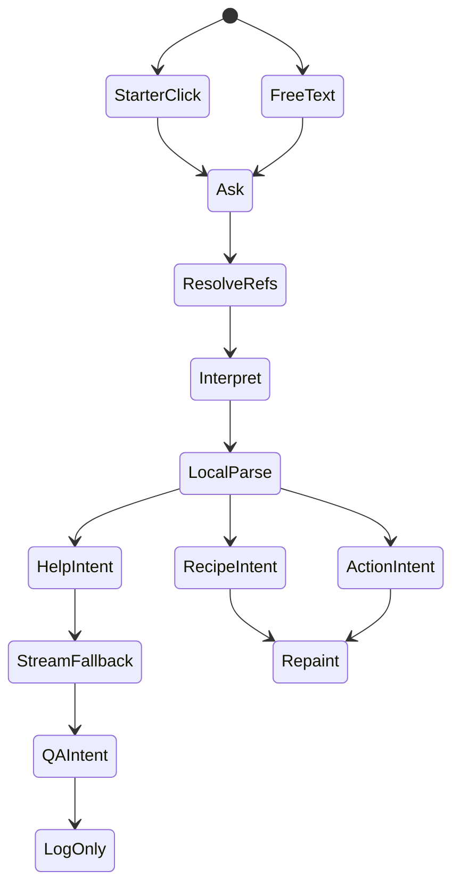

## 9) B1 New-Site Neighbor Session
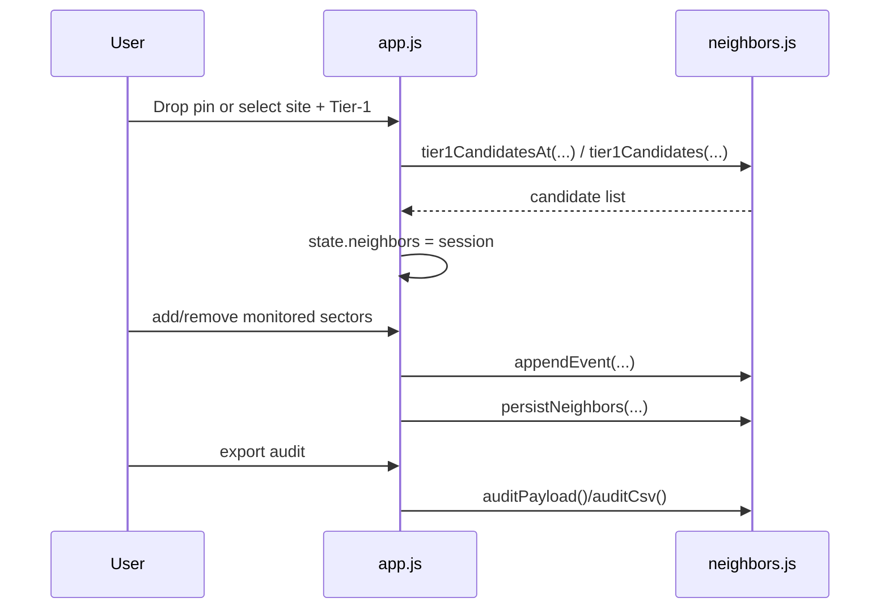

## 10) Layer Composition Rules
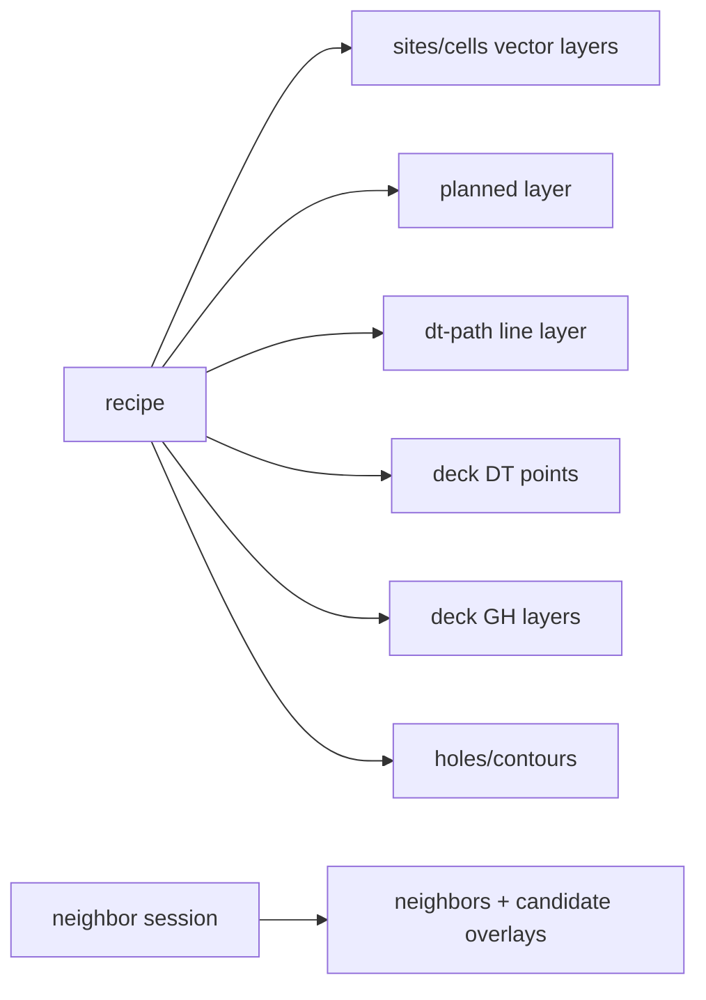

## 11) Ingest Publish Pipeline Detail
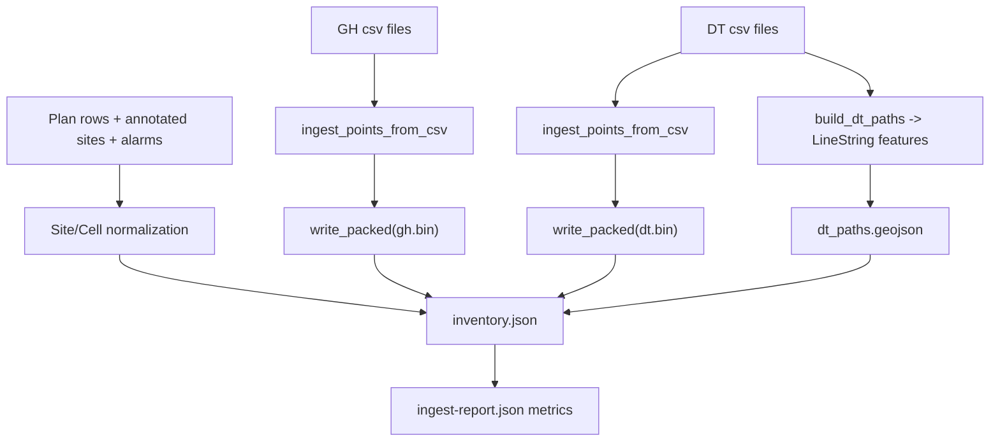

## 12) Export Behavior
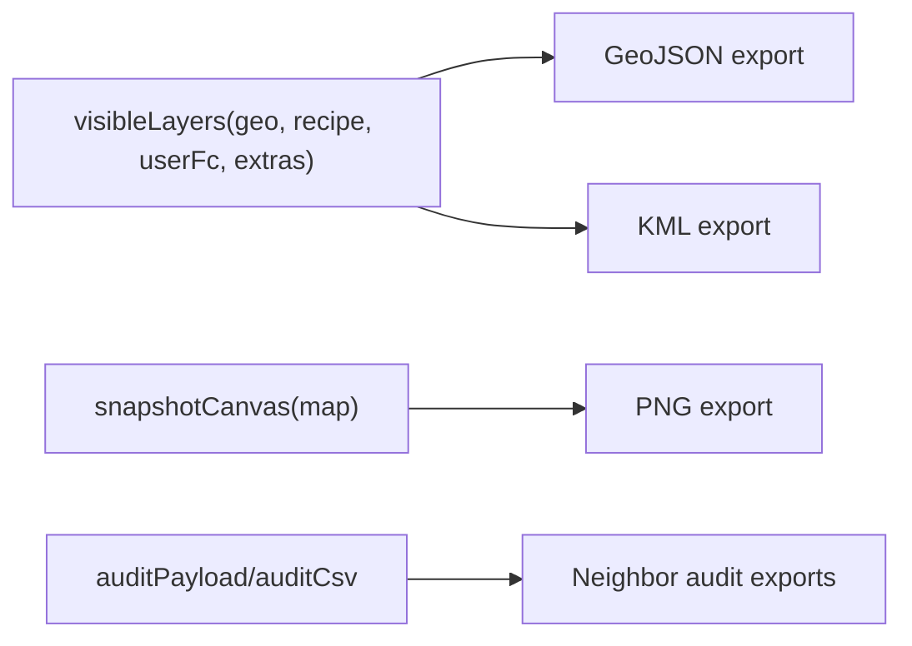

Notes:
- GH/DT sample points remain GPU assets (not dumped as giant vector exports).
- DT route vectors (`dt-paths`) are exportable when enabled by recipe.

## 13) Error and Fallback Paths
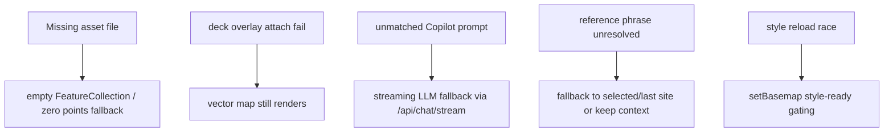

## 14) Performance Controls
- packed float32 assets for high-density measurements.
- zoom-aware GH rendering strategy (hex/heat/scatter split).
- DT route compaction in ingest to bound line complexity.
- centralized `paint()` pipeline to limit render drift.

## 15) LLD Acceptance Checklist
- `boot()` loads `inventory.json`, packed binaries, and DT routes.
- `dtLayer` displays DT line routes + DT points.
- basemap switch keeps overlays and selections without refresh.
- Copilot chips trigger deterministic recipe/action transitions.
- Unknown prompts stream from `/api/chat/stream` without blocking UI.
- per-user session memory is isolated and resettable via API/UI controls.
- follow-up references (`that site`, `second one`, area/alarm form) resolve consistently.
- neighbor session persists and exports auditable trail.
- vector exports reflect active recipe and include DT route vectors.
